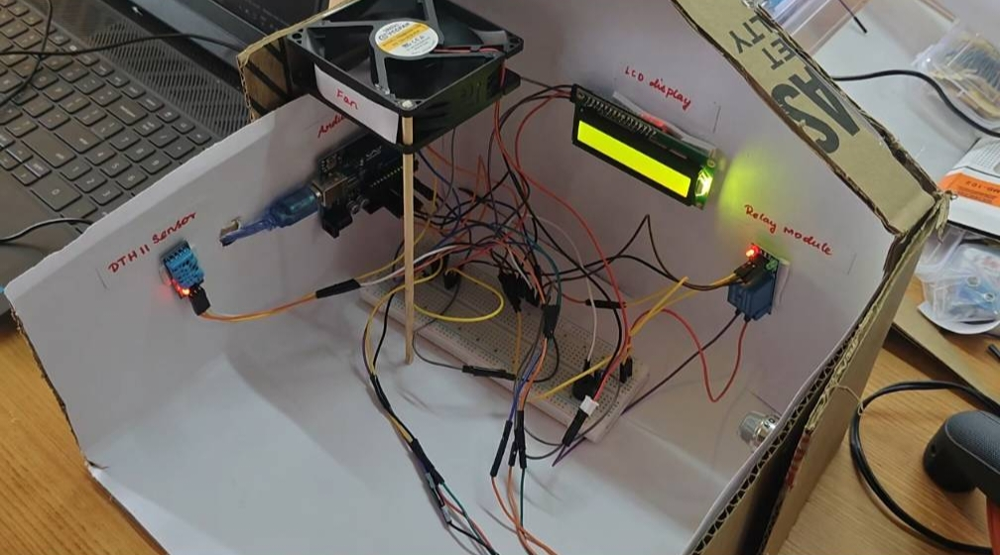
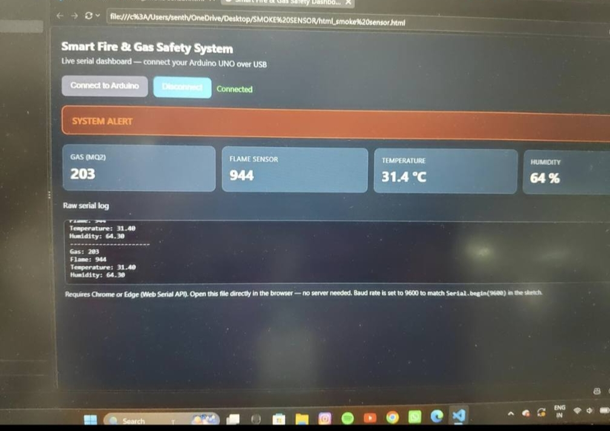
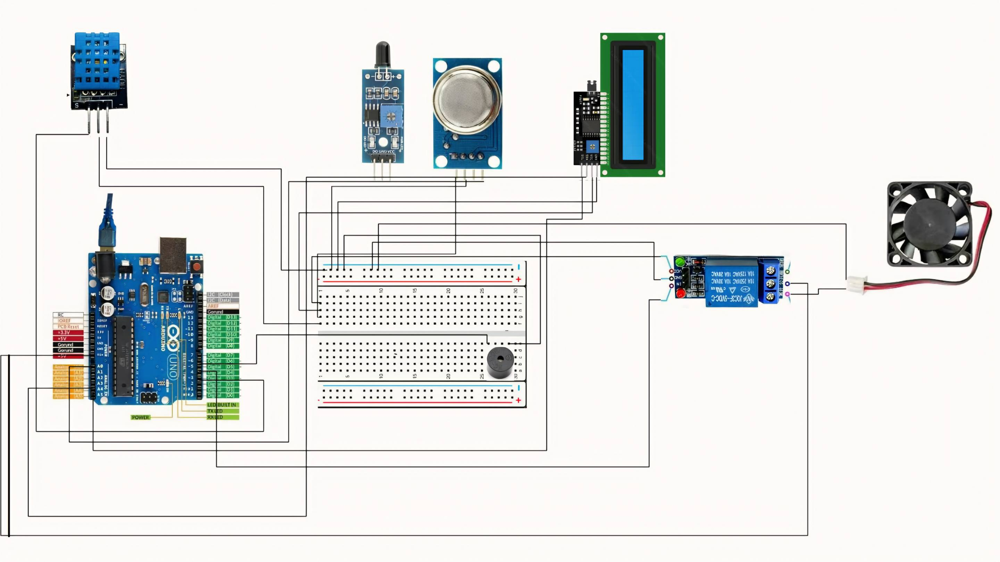

**Smart Fire & Gas Safety System Using Arduino UNO**

**Introduction**  
The Smart Fire & Gas Safety System is an Arduino UNO based safety system designed to detect gas leakage, fire, and high temperature. The system provides an immediate warning through a buzzer and automatically controls a 12V DC fan using a relay.

**Problem Statement**  
Fire accidents and gas leakage can cause serious damage to people and property. Early detection is important to reduce the risk. This project provides a simple and low-cost system to detect dangerous conditions and give an immediate alert.

**Components Used**

* Arduino UNO  
* MQ-2 Gas Sensor  
* Flame Sensor  
* DHT11 Temperature and Humidity Sensor  
* 16x2 I2C LCD, Relay Module  
* Buzzer  
* 12V DC Fan  
* 12V Power Supply.

**Working Principle**  
The MQ-2 sensor detects gas leakage, the Flame Sensor detects fire, and the DHT11 measures temperature and humidity. The Arduino UNO continuously reads the sensor values. When gas, fire, or high temperature is detected, the Arduino activates the buzzer and relay. The relay turns ON the 12V DC fan, while the LCD displays the warning status.

**Features**

* Gas leakage detection  
* Fire detection  
* Temperature and humidity monitoring  
* Automatic fan control  
* Buzzer alert  
* LCD status display  
* Laptop-based live monitoring

**Live Monitoring**  
The Arduino UNO is connected to a laptop through USB. The sensor values are sent through the Serial Port and displayed on a local web dashboard. The dashboard shows gas value, flame value, temperature, humidity, fan status, buzzer status, and alert status

**Applications**

This system can be used in homes, kitchens, laboratories, workshops, small industries, and other areas where fire and gas safety is important.

**working image**  
****

**Dashboard image**  
****

**Block Diagram**  
****  
**Schematic diagram**  
****
**Program in arduino**  
\#include \<Wire.h\>  
\#include \<LiquidCrystal\_I2C.h\>  
\#include \<DHT.h\>

// \---------- PINS \----------  
\#define MQ2\_PIN     A0  
\#define FLAME\_PIN   A1  
\#define DHT\_PIN     3  
\#define DHT\_TYPE    DHT11

\#define RELAY\_PIN   4  
\#define BUZZER\_PIN  5

// \---------- OBJECTS \----------  
LiquidCrystal\_I2C lcd(0x27, 16, 2);  
DHT dht(DHT\_PIN, DHT\_TYPE);

// \---------- LIMITS \----------  
int GAS\_LIMIT \= 400;  
int FLAME\_LIMIT \= 500;  
float TEMP\_LIMIT \= 50.0;

// Relay is ACTIVE LOW  
\#define RELAY\_ON  LOW  
\#define RELAY\_OFF HIGH

void setup() {

  Serial.begin(9600);

  pinMode(RELAY\_PIN, OUTPUT);  
  pinMode(BUZZER\_PIN, OUTPUT);

  // Start in normal condition  
  digitalWrite(RELAY\_PIN, RELAY\_OFF);  
  digitalWrite(BUZZER\_PIN, LOW);

  dht.begin();

  lcd.init();  
  lcd.backlight();

  lcd.setCursor(0, 0);  
  lcd.print("SMART SAFETY");  
  lcd.setCursor(0, 1);  
  lcd.print("SYSTEM STARTING");

  delay(2000);  
  lcd.clear();  
}

void loop() {

  // \---------- READ SENSORS \----------

  int gasValue \= analogRead(MQ2\_PIN);  
  int flameValue \= analogRead(FLAME\_PIN);

  float temperature \= dht.readTemperature();  
  float humidity \= dht.readHumidity();

  // \---------- DETECTION \----------

  bool fireDetected \= false;  
  bool gasDetected \= false;  
  bool tempHigh \= false;

  // Flame sensor  
  if (flameValue \< FLAME\_LIMIT) {  
    fireDetected \= true;  
  }

  // MQ-2  
  if (gasValue \> GAS\_LIMIT) {  
    gasDetected \= true;  
  }

  // DHT11  
  if (\!isnan(temperature) && temperature \>= TEMP\_LIMIT) {  
    tempHigh \= true;  
  }

  // \---------- SERIAL MONITOR \----------

  Serial.println("----------------------");

  Serial.print("Gas: ");  
  Serial.println(gasValue);

  Serial.print("Flame: ");  
  Serial.println(flameValue);

  Serial.print("Temperature: ");  
  Serial.println(temperature);

  Serial.print("Humidity: ");  
  Serial.println(humidity);

  // \---------- ALERT \----------

  if (fireDetected || gasDetected || tempHigh) {

    // ACTIVE-LOW RELAY  
    digitalWrite(RELAY\_PIN, RELAY\_ON);

    // Buzzer ON  
    digitalWrite(BUZZER\_PIN, HIGH);

    lcd.clear();

    lcd.setCursor(0, 0);  
    lcd.print("\!\!\! WARNING \!\!\!");

    lcd.setCursor(0, 1);

    if (fireDetected) {  
      lcd.print("FIRE DETECTED\!");  
      Serial.println("FIRE ALERT\!");  
    }

    else if (gasDetected) {  
      lcd.print("GAS DETECTED\!");  
      Serial.println("GAS ALERT\!");  
    }

    else if (tempHigh) {  
      lcd.print("HIGH TEMP\!");  
      Serial.println("TEMP ALERT\!");  
    }

  }

  // \---------- NORMAL \----------

  else {

    // Relay OFF  
    digitalWrite(RELAY\_PIN, RELAY\_OFF);

    // Buzzer OFF  
    digitalWrite(BUZZER\_PIN, LOW);

    lcd.clear();

    lcd.setCursor(0, 0);  
    lcd.print("SYSTEM NORMAL");

    lcd.setCursor(0, 1);  
    lcd.print("G:");  
    lcd.print(gasValue);

    lcd.print(" T:");

    if (\!isnan(temperature)) {  
      lcd.print(temperature, 1);  
      lcd.print("C");  
    }  
    else {  
      lcd.print("ERR");  
    }  
  }

  delay(1000);  
}

**Limitations**

* MQ-2 requires warm-up time  
* Sensor readings may vary depending on environment  
* Laptop monitoring requires USB connection  
* The prototype is intended for demonstration and educational purposes

**Risks While Building**

* Wrong wiring may damage components.  
* Short circuits can cause overheating.  
* Incorrect voltage can damage the circuit.  
* Fire/gas testing can be dangerous.  
* Loose connections may cause malfunction.  
* Incorrect sensor calibration may cause false alerts

**Safety Precautions**  
Always disconnect the power before changing wiring, use proper power supplies, and  
perform demonstrations in a safe, controlled environment.

**Authors**

1. Shajahan S  
2. Senthil Kumaran C

**Lisence**  
This project is licensed under the GNU GENERAL PUBLIC LICENSE \- see the LICENSE file for details.
